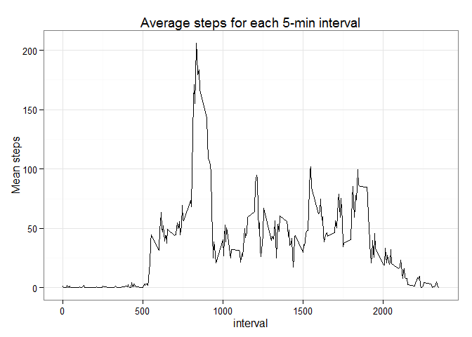

# Reproducible Research - Peer Assessment 1
Debra Griffin  
Sunday, January 11, 2015  

## Introduction

It is now possible to collect a large amount of data about personal movement using activity monitoring devices such as a [Fitbit](http://www.fitbit.com/), [Nike Fuelband](http://www.nike.com/us/en_us/c/nikeplus-fuelband), or [Jawbone Up](https://jawbone.com/up). These type of devices are part of the "quantified self" movement - a group of enthusiasts who take measurements about themselves regularly to improve their health, to find patterns in their behavior, or because they are tech geeks. But these data remain under-utilized both because the raw data are hard to obtain and there is a lack of statistical methods and software for processing and interpreting the data.

This assignment makes use of data from a personal activity monitoring device. This device collects data at 5 minute intervals through out the day. The data consists of two months of data from an anonymous individual collected during the months of October and November, 2012 and include the number of steps taken in 5 minute intervals each day.

## Data

The data for this assignment can be downloaded from the course web site:

Dataset: [Activity monitoring data - 52K](https://d396qusza40orc.cloudfront.net/repdata%2Fdata%2Factivity.zip)

The variables included in this dataset are:

**steps:** Number of steps taking in a 5-minute interval (missing values are coded as NA)

**date:** The date on which the measurement was taken in YYYY-MM-DD format

**interval:** Identifier for the 5-minute interval in which measurement was taken

The dataset is stored in a comma-separated-value (CSV) file and there are a total of 17,568 observations in this dataset.

## Assignment

This assignment will be described in multiple parts. You will need to write a report that answers the questions detailed below. Ultimately, you will need to complete the entire assignment in a single R markdown document that can be processed by knitr and be transformed into an HTML file.

Throughout your report make sure you always include the code that you used to generate the output you present. When writing code chunks in the R markdown document, always use echo = TRUE so that someone else will be able to read the code. This assignment will be evaluated via peer assessment so it is essential that your peer evaluators be able to review the code for your analysis.

For the plotting aspects of this assignment, feel free to use any plotting system in R (i.e., base, lattice, ggplot2)

Fork/clone the GitHub repository created for this assignment. You will submit this assignment by pushing your completed files into your forked repository on GitHub. The assignment submission will consist of the URL to your GitHub repository and the SHA-1 commit ID for your repository state.

NOTE: The GitHub repository also contains the dataset for the assignment so you do not have to download the data separately.

## Load required packages and download the data

setup required libraries

```r
packages <- c("lubridate", "ggplot2", "grid", "lattice")
sapply(packages, require, character.only=TRUE, quietly=TRUE)
```

```
## lubridate   ggplot2      grid   lattice 
##      TRUE      TRUE      TRUE      TRUE
```

Check for the directory, create it if it does not exist

```r
setwd("~/")
if (!file.exists("RD-PeerAssessment1")) {
        dir.create("RD-PeerAssessment1")
}
```
change working directory to new folder

```r
setwd("~/RD-PeerAssessment1") 
dir <- getwd()
```

Get the dataset

```r
setInternet2(TRUE)
temp <- tempfile()
download.file("https://d396qusza40orc.cloudfront.net/repdata%2Fdata%2Factivity.zip", temp)
```

```
## Warning in
## download.file("https://d396qusza40orc.cloudfront.net/repdata%2Fdata%2Factivity.zip",
## : downloaded length 53559 != reported length 53559
```
get the name in the zip archive

```r
fname = unzip(temp, list=TRUE)$Name
```
unzip the file to the working directory

```r
unzip(temp, files=fname, exdir=dir, overwrite=TRUE)
```

## Loading and preprocessing the data

Show any code that is needed to:

- Load the data (i.e. read.csv())
- Process/transform the data (if necessary) into a format suitable for your analysis


make sure the file exists

```r
if (!file.exists(fname)) {
        print("The file you are attempting to read: " + fname + " does not exist. /n
              Please make sure you have downloaded the file and it is in your working directory.")
}
```
read the data

```r
activity <- read.csv(file=fname, header=TRUE, sep="," ,stringsAsFactors=FALSE)

## activity$date, needs to be a Date class
colnames(activity)[2] <- "dateChar"
activity$date <- as.Date(strptime(activity$dateChar, format="%Y-%m-%d"))
```
Verify that the number of rows in the dataset is the expected value of 17,568 and look at the dataset.


```r
check <- nrow(activity) == 17568
if (check == FALSE) stop("The number of rows in the dataset is not 17,568.")
str(activity)
```

```
## 'data.frame':	17568 obs. of  4 variables:
##  $ steps   : int  NA NA NA NA NA NA NA NA NA NA ...
##  $ dateChar: chr  "2012-10-01" "2012-10-01" "2012-10-01" "2012-10-01" ...
##  $ interval: int  0 5 10 15 20 25 30 35 40 45 ...
##  $ date    : Date, format: "2012-10-01" "2012-10-01" ...
```

```r
sum(activity$steps, na.rm=TRUE)
```

```
## [1] 570608
```
Create the dataset for steps per day and interval steps.


```r
stepsPerDay <- as.data.frame(aggregate(steps ~ date, data=activity, FUN="sum"))
colnames(stepsPerDay)[2] <- "totalsteps"

intervalSteps <- as.data.frame(aggregate(steps ~ interval, data=activity, FUN="mean"))
colnames(intervalSteps)[2] <- "meansteps"
```

View the datasets for stepsperday and intervalstepsper5min.

```r
str(stepsPerDay)
```

```
## 'data.frame':	53 obs. of  2 variables:
##  $ date      : Date, format: "2012-10-02" "2012-10-03" ...
##  $ totalsteps: int  126 11352 12116 13294 15420 11015 12811 9900 10304 17382 ...
```

```r
str(intervalSteps)
```

```
## 'data.frame':	288 obs. of  2 variables:
##  $ interval : int  0 5 10 15 20 25 30 35 40 45 ...
##  $ meansteps: num  1.717 0.3396 0.1321 0.1509 0.0755 ...
```

## What is mean and median total number of steps taken per day?
*For this part of the assignment, you can ignore the missing values in the dataset.*

**The mean total number of steps taken per day is 10766 and the median number of steps taken per day is 10765.**

Plot a histogram of the total number of steps taken each day.


```r
histStepsTakenPerDay <- ggplot(stepsPerDay,aes(x=totalsteps))+geom_histogram(binwidth=1000)+
  xlab("Steps per day")+
  ggtitle("Total steps taken each day")+
  theme_bw()
print(histStepsTakenPerDay)
```

 

## What is the average daily activity pattern?

- Make a time series plot (i.e. type = "l") of the 5-minute interval (x-axis) and the average number of steps taken, averaged across all days (y-axis)


```r
dailyLine <- ggplot(intervalSteps, aes(x=interval, y=meansteps))+ geom_line()+
  ggtitle("Average steps for each 5-min interval")+
  ylab("Mean steps")+
  theme_bw()
print(dailyLine)
```

 

- Which 5-minute interval, on average across all the days in the dataset, contains the maximum number of steps?

**The 5-minute interval, on average across all days in the dataset is interval number 835 with a steps count of 206 steps.**

## Changes for missing values

Note that there are a number of days/intervals where there are missing values (coded as NA). The presence of missing days may introduce bias into some calculations or summaries of the data.

- Calculate and report the total number of missing values in the dataset (i.e. the total number of rows with NAs)

**The number of NA's in the activity dataset is 2304.**

- Devise a strategy for filling in all of the missing values in the dataset. The strategy does not need to be sophisticated. For example, you could use the mean/median for that day, or the mean for that 5-minute interval, etc.

- Create a new dataset that is equal to the original dataset but with the missing data filled in.

```r
imputedActivity <- activity
imputedActivity$steps[is.na(imputedActivity$steps)] <- 0

summary(activity)
```

```
##      steps          dateChar            interval           date           
##  Min.   :  0.00   Length:17568       Min.   :   0.0   Min.   :2012-10-01  
##  1st Qu.:  0.00   Class :character   1st Qu.: 588.8   1st Qu.:2012-10-16  
##  Median :  0.00   Mode  :character   Median :1177.5   Median :2012-10-31  
##  Mean   : 37.38                      Mean   :1177.5   Mean   :2012-10-31  
##  3rd Qu.: 12.00                      3rd Qu.:1766.2   3rd Qu.:2012-11-15  
##  Max.   :806.00                      Max.   :2355.0   Max.   :2012-11-30  
##  NA's   :2304
```

```r
summary(imputedActivity)
```

```
##      steps          dateChar            interval           date           
##  Min.   :  0.00   Length:17568       Min.   :   0.0   Min.   :2012-10-01  
##  1st Qu.:  0.00   Class :character   1st Qu.: 588.8   1st Qu.:2012-10-16  
##  Median :  0.00   Mode  :character   Median :1177.5   Median :2012-10-31  
##  Mean   : 32.48                      Mean   :1177.5   Mean   :2012-10-31  
##  3rd Qu.:  0.00                      3rd Qu.:1766.2   3rd Qu.:2012-11-15  
##  Max.   :806.00                      Max.   :2355.0   Max.   :2012-11-30
```
Create a comparable dataset to 'stepsperday' which was created from the original 'activity' dataset for the imputed histogram and verify integrity.


```r
imputedStepsPerDay <- as.data.frame(aggregate(steps ~ date, data=imputedActivity, FUN="sum"))
colnames(imputedStepsPerDay)[2] <- "totalsteps"
str(imputedStepsPerDay)
```

```
## 'data.frame':	61 obs. of  2 variables:
##  $ date      : Date, format: "2012-10-01" "2012-10-02" ...
##  $ totalsteps: num  0 126 11352 12116 13294 ...
```

```r
sum(stepsPerDay$totalsteps, na.rm=TRUE) == sum(imputedStepsPerDay$totalsteps)
```

```
## [1] TRUE
```
- Make a histogram of the total number of steps taken each day and Calculate and report the mean and median total number of steps taken per day.   

Do these values differ from the estimates from the first part of the assignment? ***Yes*** 

What is the impact of imputing missing data on the estimates of the total daily number of steps?  ***The overall impact of the imputed values is to lower the estimates of the number of steps taken each day. However, the sum of the total steps is equal between the datasets.***  

The mean total number of steps taken per day from the **original dataset** is **10766**  
The mean total number of steps taken per day from the **imputed dataset** is **9354**  

The median number of steps taken per day from the **original dataset** is **10765.**  
The median number of steps taken per day from the **imputed dataset** is **10395.**


Plot a histogram of the total number of steps taken each day from the imputed dataset.

 

### Are there differences in activity patterns between weekdays and weekends?

For this part the `weekdays()` function may be of some help here. Use
the dataset with the filled-in missing values for this part.

1. Create a new factor variable in the dataset with two levels -- "weekday" and "weekend" indicating whether a given date is a weekday or weekend day.

2. Make a panel plot containing a time series plot (i.e. `type = "l"`) of the 5-minute interval (x-axis) and the average number of steps taken, averaged across all weekday days or weekend days (y-axis). 

- Create a new factor variable in the dataset with two levels - "weekday" and "weekend" indicating whether a given date is a weekday or weekend day.
Use this solution to [collapse the factor values](http://stackoverflow.com/a/9053619) for day of week.
Verify that `dayOfWeek` and `dayType` are factor class variables.


```r
imputedActivity = within(imputedActivity,{ 
    DOWGroup = as.factor(ifelse((weekdays(imputedActivity$date, abbreviate=TRUE) %in% c("Sat","Sun")), "weekend",      
    "weekday"))
    }
)
table(imputedActivity$DOWGroup)
```

```
## 
## weekday weekend 
##   12960    4608
```
       
- Make a panel plot containing a time series plot (i.e. type = "l") of the 5-minute interval (x-axis) and the average number of steps taken, averaged across all weekday days or weekend days (y-axis). See the README file in the GitHub repository to see an example of what this plot should look like using simulated data.

Prep the data and create the plot

```r
imputedIntervalStepsDOW <- as.data.frame(aggregate(steps ~ DOWGroup + interval, data=imputedActivity, FUN="mean"))
colnames(imputedIntervalStepsDOW)[3] <- "meansteps"
str(imputedIntervalStepsDOW)
```

```
## 'data.frame':	576 obs. of  3 variables:
##  $ DOWGroup : Factor w/ 2 levels "weekday","weekend": 1 2 1 2 1 2 1 2 1 2 ...
##  $ interval : int  0 0 5 5 10 10 15 15 20 20 ...
##  $ meansteps: num  2.022 0 0.4 0 0.156 ...
```

```r
lattice.options(default.theme = standard.theme(color = FALSE))
xyplot(meansteps ~ interval | DOWGroup, data=imputedIntervalStepsDOW
    , layout=c(1,2)
    , main="Mean steps over each 5min interval split by weekday/weekend", xlab="5-Minute interval ID"
    , ylab="Average Steps Taken", type=c("l","l"))
```

 

The weekend days are clearly more active then weekdays.

## Submitting the Assignment

To submit the assignment:

- Commit the your completed PA1_template.Rmd file to the master branch of your git repository (you should already be on the master branch unless you created new ones)

- Commit your PA1_template.md and PA1_template.html files produced by processing your R markdown file with knit2html() function in R (from the knitr package) by running the function from the console.

- If your document has figures included (it should) then they should have been placed in the figure/ directory by default (unless you overrided the default). Add and commit the figure/ directory to your git repository so that the figures appear in the markdown file when it displays on github.

Push your master branch to GitHub.

- Submit the URL to your GitHub repository for this assignment on the course web site.

- In addition to submitting the URL for your GitHub repository, you will need to submit the 40 character SHA-1 hash (as string of numbers from 0-9 and letters from a-f) that identifies the repository commit that contains the version of the files you want to submit. You can do this in GitHub by doing the following

- Going to your GitHub repository web page for this assignment

- Click on the "?? commits" link where ?? is the number of commits you have in the repository. For example, if you made a total of 10 commits to this repository, the link should say "10 commits".

You will see a list of commits that you have made to this repository. The most recent commit is at the very top. If this represents the version of the files you want to submit, then just click the "copy to clipboard" button on the right hand side that should appear when you hover over the SHA-1 hash. Paste this SHA-1 hash into the course web site when you submit your assignment. If you don't want to use the most recent commit, then go down and find the commit you want and copy the SHA-1 hash.

A valid submission will look something like (this is just an example!)

- https://github.com/rdpeng/RepData_PeerAssessment1

- 7c376cc5447f11537f8740af8e07d6facc3d9645

